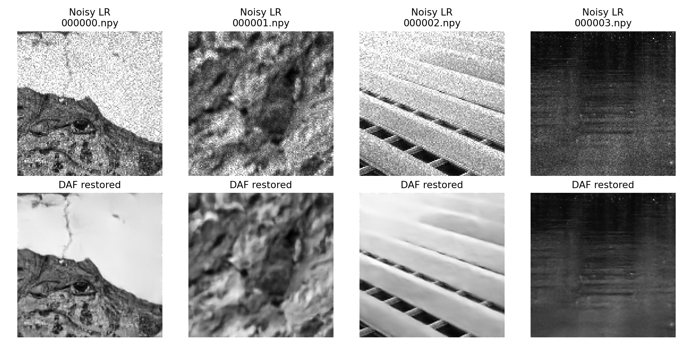

# KLA Semiconductor Image Restoration Benchmarks

Reproducible benchmark suite for SEMICON India Hackathon 2026, Track 1 / KLA
PS01. It learns a joint mapping from noisy 128x128 grayscale NumPy arrays to
clean 256x256 ground truth.

The verified problem brief, official downloads, dataset manifest, and sample
preview are under
[`hackathon/semicon-image-restoration-hackathon-2026`](hackathon/semicon-image-restoration-hackathon-2026/README.md).

## Clone, install, and run the submission evaluator

The evaluator needs Python 3.12+, Git, and [Git LFS](https://git-lfs.com/).
The checkpoint and the 400 submitted arrays are LFS objects, so materialize
them before running inference.

```bash
git clone https://github.com/IAM-MUKUND/image-restoration-project.git
cd image-restoration-project
git lfs install
git lfs pull
python -m venv .venv
```

Activate the environment and install the fully pinned dependency lock:

```bash
# Linux / macOS
source .venv/bin/activate

# Windows PowerShell (use this instead of the line above)
# .\.venv\Scripts\Activate.ps1

python -m pip install --upgrade pip
python -m pip install -r requirements.txt
```

Run the standalone KLA evaluator using the required entry script format:

```bash
python run.py /path/to/Test_NoisyLR /path/to/restored_test
```

`run.py` automatically loads the included `models/checkpoints/best.pt` model weights and runs in the verified eight-view geometric self-ensemble accuracy mode on CUDA GPU. It reads all `.npy` input files, creates the output directory if missing, preserves every input filename, and outputs a sanitized `float32` array of target shape `[256, 256]` strictly bounded within `[0, 1]` with no `NaN` or `Inf` values.

Flags and positional arguments:
- `python run.py <input-dir> <output-dir>` (Positional execution required for hackathon submission)
- `python run.py --input /path/to/input --output /path/to/output` (Supported for backward compatibility)
- `--self-ensemble 1` (Use 1 for ultra-low-latency inference, default is 8 for maximum competition accuracy)
- `--weights /path/to/weights.pt` (Optional path to custom weight checkpoint)


Submission-ready outputs generated from all 400 official test inputs are in
[`artifacts/remote-runs/daf-final-submission/predictions`](artifacts/remote-runs/daf-final-submission/predictions/),
with validation evidence in
[`INFERENCE-VALIDATION.json`](artifacts/remote-runs/daf-final-submission/INFERENCE-VALIDATION.json).

## Benchmark matrix

All trainable models use the same seed, 2,880/320 split, augmentation policy,
optimizer, reconstruction loss, metrics, and latency procedure.

| Key | Adaptation |
|---|---|
| `bicubic` | Non-learning floor |
| `nafnet` | Compact NAFNet plus 2x PixelShuffle and bicubic residual |
| `swinir` | Compact shifted-window SwinIR plus 2x head |
| `restormer` | Compact two-level Restormer plus 2x head |
| `esrgan_rrdb` | ESRGAN RRDB generator in fidelity mode; no GAN loss |
| `mprnet` | Compact three-stage progressive supervised-attention model |
| `daf_restormer` | Experimental degradation-aware spatial/frequency Restormer |

These are task-adapted, compute-matched variants. They are not claimed to be
bit-for-bit copies of every official repository. In particular, adversarial
training is intentionally disabled for the ESRGAN generator because invented
inspection structures are unsafe and would make a PSNR/SSIM comparison unfair.

### Experimental DAF-Restormer

`daf_restormer` is the project-specific successor to the compact Restormer. It
adds a learned global degradation prompt, a spatial noise-strength map,
prompt-conditioned transformer blocks, frequency-gated bottleneck refinement,
an auxiliary clean-128x128 head, and a calibrated uncertainty head. Its mixed
degradation augmentation can synthesize random-order blur/downsample/speckle/
Gaussian observations from clean targets without clipping out-of-range inputs.

```bash
python train.py \
  --model daf_restormer \
  --data-root hackathon/semicon-image-restoration-hackathon-2026/dataset/extracted/train \
  --epochs 30 \
  --batch-size 8 \
  --frequency-weight 0.03 \
  --gradient-weight 0.02 \
  --synthetic-probability 0.35
```

The controlled experiments below now establish both its direct-model tradeoffs
and its winning accuracy-mode recipe.

## New accuracy winner: DAF-Restormer-P

The final model is DAF-Restormer with two low-rate 128x128 perceptual
fine-tuning epochs, one still-lower-rate full-resolution SSIM/LPIPS epoch, and
an eight-view dihedral self-ensemble at inference. The comparison uses the
identical 2,880/320 split, seed 42, and T4 metric implementation as the
converged 10-epoch Restormer control.

| 10-epoch candidate | PSNR dB | SSIM | LPIPS (lower) | T4 latency ms |
|---|---:|---:|---:|---:|
| Restormer control | 28.3931 | 0.770946 | 0.271908 | **13.66** |
| DAF architecture, direct | 28.4393 | 0.768348 | 0.278325 | 31.99 |
| DAF-Restormer-P, direct | 28.3722 | 0.768031 | **0.221701** | 35.80 |
| **DAF-Restormer-P, 8-view accuracy mode** | **28.4713** | **0.771162** | 0.228489 | 264.72 |

The selected recipe improves PSNR by 0.0782 dB and SSIM by 0.000216 while
reducing LPIPS by 16.0% relative to Restormer. It is an accuracy-first entry;
the direct checkpoint remains available when latency matters. Synthetic mixed
degradation, residual calibration, and the first downsampled-perceptual recipe
were retained as negative or tradeoff ablations instead of being presented as
wins.

- [Final model card](artifacts/remote-runs/daf-final-submission/MODEL-CARD.md)
- [Selected checkpoint](artifacts/remote-runs/daf-final-submission/checkpoints/daf-restormer-perceptual-epoch1.pt)
- [Selection metrics](artifacts/remote-runs/daf-final-submission/SELECTION.json)
- [400-image validation](artifacts/remote-runs/daf-final-submission/INFERENCE-VALIDATION.json)
- [Full TTA evidence](artifacts/remote-runs/daf-stage2-tta/epoch-1.json)



## T4 benchmark result

The fixed-budget Colab run used all 2,880 training and 320 held-out validation
pairs, three epochs per model, batch size 8, seed 42, AMP, and the same
Charbonnier + SSIM loss. Lower LPIPS is better; higher PSNR/SSIM is better.

| Model | PSNR dB | SSIM | LPIPS | Median latency ms | Parameters |
|---|---:|---:|---:|---:|---:|
| Bicubic | 23.279 | 0.5443 | 0.4312 | 0.128 | 0 |
| NAFNet | 25.932 | 0.6467 | 0.3952 | 10.040 | 253,057 |
| SwinIR | 26.377 | 0.6588 | 0.3641 | 21.564 | 405,505 |
| **Restormer** | **26.614** | **0.6778** | 0.3334 | 17.293 | 1,608,757 |
| ESRGAN-RRDB | 26.514 | 0.6721 | **0.3314** | 13.984 | 1,136,097 |
| MPRNet | 25.955 | 0.6478 | 0.3692 | 11.056 | 265,451 |

Restormer is the strongest quality baseline from this short run. ESRGAN-RRDB is
the closest alternative and gives the best LPIPS; NAFNet is the speed/size
baseline. These checkpoints are candidates for longer training, not converged
competition models.

- Detailed report: [`artifacts/remote-runs/colab-full/BENCHMARK-REPORT.md`](artifacts/remote-runs/colab-full/BENCHMARK-REPORT.md)
- Machine-readable results: [`benchmark_summary.json`](artifacts/remote-runs/colab-full/benchmark_summary.json)
- Checkpoint/archive hashes: [`CHECKSUMS.sha256`](artifacts/remote-runs/colab-full/CHECKSUMS.sha256)
- Colab execution history: [`artifacts/colab-session-history.ipynb`](artifacts/colab-session-history.ipynb)
- 400-image inference validation: [`INFERENCE-VALIDATION.json`](artifacts/remote-runs/colab-full/INFERENCE-VALIDATION.json)


## Data

Raw training arrays, official input archives, and ZIP files are intentionally
ignored by Git. The already-restored 400-image submission folder is tracked via
Git LFS. A local extracted dataset has this layout:

```text
hackathon/semicon-image-restoration-hackathon-2026/dataset/extracted/
|- train/GT/       3,200 x float32 [256, 256]
|- train/NoisyLR/  3,200 x float32 [128, 128]
`- NoisyLR/          400 test inputs
```

The loader preserves degraded values outside `[0,1]`, pairs samples by exact
filename, and uses separate dataset instances for training and validation.

The released arrays visibly contain generic grayscale natural scenes rather
than obvious wafer or microscopy imagery. This is confirmed by the official KLA
training download and is not a preprocessing mistake. Treat semantic and
acquisition-domain shift as a first-class validation risk.

## Run all benchmarks

```bash
python benchmark_all.py \
  --epochs 3 \
  --batch-size 16 \
  --output-dir artifacts/benchmark
```

For a quick pipeline check:

```bash
python benchmark_all.py \
  --epochs 1 \
  --train-limit 128 \
  --val-limit 32 \
  --batch-size 4 \
  --skip-lpips \
  --output-dir artifacts/smoke
```

Each model writes:

```text
artifacts/benchmark/<model>/
|- checkpoints/best.pt
|- metrics.json
`- predictions/*.npy
```

`artifacts/benchmark/benchmark_summary.json` is updated after every model, so a
partial run remains auditable. Intermediate model weights remain local. The
selected final checkpoint is tracked in Git LFS together with its metrics and
checksum evidence.

## Standalone inference

```bash
python infer.py \
  --input hackathon/semicon-image-restoration-hackathon-2026/dataset/extracted/NoisyLR \
  --output outputs/restored_test
```

The command automatically loads the selected checkpoint and architecture, then
writes one restored 256x256 `float32` `.npy` file per input. Set
`--self-ensemble 1` for direct low-latency inference or `4` for a middle ground.

## Reproduce training

The required training entry point is `train.py`. With the official training
data extracted as documented in the problem-brief folder, reproduce the core
DAF-Restormer run with:

```bash
python train.py \
  --model daf_restormer \
  --data-root hackathon/semicon-image-restoration-hackathon-2026/dataset/extracted/train \
  --output-dir artifacts/reproduction/daf-restormer \
  --epochs 10 \
  --batch-size 8
```

The accuracy checkpoint was then refined with
[`scripts/finetune_daf_perceptual.py`](scripts/finetune_daf_perceptual.py); the
exact selection recipe and evidence are recorded in the final
[`MODEL-CARD.md`](artifacts/remote-runs/daf-final-submission/MODEL-CARD.md).

## Rebuild the dependency lock

`requirements.txt` is a resolver-generated, transitive and platform-aware lock
for Python 3.12. When changing a direct dependency in `requirements.in`, rebuild
it with:

```bash
uv pip compile requirements.in --python-version 3.12 --universal --no-header --output-file requirements.txt
```

## Metrics

- PSNR after output clamping to `[0,1]`
- SSIM at data range 1.0
- LPIPS-AlexNet with grayscale repeated to three channels
- median and p90 model latency for batch size 1
- validation throughput, training duration, parameter count, peak CUDA memory

## Tests

```bash
pytest -q
```

The tests check output shapes, finite values, strict input/target pairing,
independent train/validation augmentation, and preservation of out-of-range
degraded intensities.
