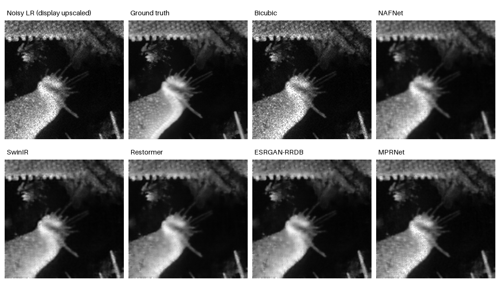

# KLA Semiconductor Image Restoration Benchmarks

Reproducible benchmark suite for SEMICON India Hackathon 2026, Track 1 / KLA
PS01. It learns a joint mapping from noisy 128x128 grayscale NumPy arrays to
clean 256x256 ground truth.

The verified problem brief, official downloads, dataset manifest, and sample
preview are under
[`hackathon/semicon-image-restoration-hackathon-2026`](hackathon/semicon-image-restoration-hackathon-2026/README.md).

## Benchmark matrix

All trainable models use the same seed, 2,880/320 split, augmentation policy,
optimizer, reconstruction loss, metrics, and latency procedure.

| Key | Adaptation |
|---|---|
| `bicubic` | Non-learning floor |
| `nafnet` | Compact NAFNet plus 2x PixelShuffle and bicubic residual |
| `swinir` | Compact shifted-window SwinIR plus 2x head |
| `restormer` | Compact two-level Restormer plus 2x head |
| `esrgan_rrdb` | ESRGAN RRDB generator in fidelity mode; no GAN loss |
| `mprnet` | Compact three-stage progressive supervised-attention model |

These are task-adapted, compute-matched variants. They are not claimed to be
bit-for-bit copies of every official repository. In particular, adversarial
training is intentionally disabled for the ESRGAN generator because invented
inspection structures are unsafe and would make a PSNR/SSIM comparison unfair.

## T4 benchmark result

The fixed-budget Colab run used all 2,880 training and 320 held-out validation
pairs, three epochs per model, batch size 8, seed 42, AMP, and the same
Charbonnier + SSIM loss. Lower LPIPS is better; higher PSNR/SSIM is better.

| Model | PSNR dB | SSIM | LPIPS | Median latency ms | Parameters |
|---|---:|---:|---:|---:|---:|
| Bicubic | 23.279 | 0.5443 | 0.4312 | 0.128 | 0 |
| NAFNet | 25.932 | 0.6467 | 0.3952 | 10.040 | 253,057 |
| SwinIR | 26.377 | 0.6588 | 0.3641 | 21.564 | 405,505 |
| **Restormer** | **26.614** | **0.6778** | 0.3334 | 17.293 | 1,608,757 |
| ESRGAN-RRDB | 26.514 | 0.6721 | **0.3314** | 13.984 | 1,136,097 |
| MPRNet | 25.955 | 0.6478 | 0.3692 | 11.056 | 265,451 |

Restormer is the strongest quality baseline from this short run. ESRGAN-RRDB is
the closest alternative and gives the best LPIPS; NAFNet is the speed/size
baseline. These checkpoints are candidates for longer training, not converged
competition models.

- Detailed report: [`artifacts/remote-runs/colab-full/BENCHMARK-REPORT.md`](artifacts/remote-runs/colab-full/BENCHMARK-REPORT.md)
- Machine-readable results: [`benchmark_summary.json`](artifacts/remote-runs/colab-full/benchmark_summary.json)
- Checkpoint/archive hashes: [`CHECKSUMS.sha256`](artifacts/remote-runs/colab-full/CHECKSUMS.sha256)
- Colab execution history: [`artifacts/colab-session-history.ipynb`](artifacts/colab-session-history.ipynb)
- 400-image inference validation: [`INFERENCE-VALIDATION.json`](artifacts/remote-runs/colab-full/INFERENCE-VALIDATION.json)



## Data

Raw arrays and ZIP files are intentionally ignored by Git. The local dataset is:

```text
hackathon/semicon-image-restoration-hackathon-2026/dataset/extracted/
|- train/GT/       3,200 x float32 [256, 256]
|- train/NoisyLR/  3,200 x float32 [128, 128]
`- NoisyLR/          400 test inputs
```

The loader preserves degraded values outside `[0,1]`, pairs samples by exact
filename, and uses separate dataset instances for training and validation.

The released arrays visibly contain generic grayscale natural scenes rather
than obvious wafer or microscopy imagery. This is confirmed by the official KLA
training download and is not a preprocessing mistake. Treat semantic and
acquisition-domain shift as a first-class validation risk.

## Run all benchmarks

```bash
python benchmark_all.py \
  --epochs 3 \
  --batch-size 16 \
  --output-dir artifacts/benchmark
```

For a quick pipeline check:

```bash
python benchmark_all.py \
  --epochs 1 \
  --train-limit 128 \
  --val-limit 32 \
  --batch-size 4 \
  --skip-lpips \
  --output-dir artifacts/smoke
```

Each model writes:

```text
artifacts/benchmark/<model>/
|- checkpoints/best.pt
|- metrics.json
`- predictions/*.npy
```

`artifacts/benchmark/benchmark_summary.json` is updated after every model, so a
partial run remains auditable. Model weights are stored locally but ignored by
Git; metrics and configuration files remain trackable.

## Standalone inference

```bash
python infer.py \
  --input hackathon/semicon-image-restoration-hackathon-2026/dataset/extracted/NoisyLR \
  --output outputs/restored_test \
  --weights artifacts/remote-runs/colab-full/restormer/checkpoints/best.pt
```

The command automatically loads the architecture recorded in the checkpoint
and writes one restored 256x256 `float32` `.npy` file per input.

## Metrics

- PSNR after output clamping to `[0,1]`
- SSIM at data range 1.0
- LPIPS-AlexNet with grayscale repeated to three channels
- median and p90 model latency for batch size 1
- validation throughput, training duration, parameter count, peak CUDA memory

## Tests

```bash
pytest -q
```

The tests check output shapes, finite values, strict input/target pairing,
independent train/validation augmentation, and preservation of out-of-range
degraded intensities.
